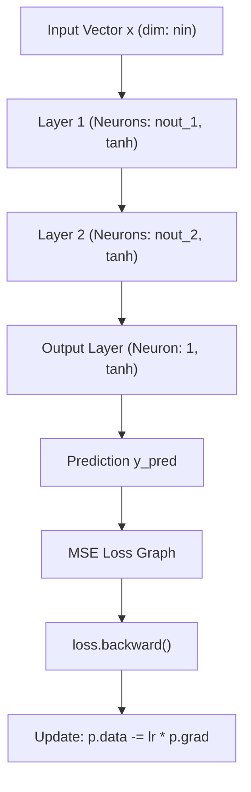

# Machine Learning & Deep Learning From Scratch

[](https://www.python.org/)
[-success.svg)](#design-philosophy)
[](#1-architecture_ml--computational-foundations)
[](LICENSE)

A comprehensive, zero-dependency educational repository implementing core Machine Learning and Deep Learning algorithms from mathematical first principles. Every component—from scalar reverse-mode automatic differentiation (autograd DAG) and multi-layer perceptrons to gradient descent optimizers, evaluation metrics, and numerically stable loss functions—is built purely in vanilla Python standard library (`math`, `random`).

---

## Table of Contents

- [Design Philosophy](#design-philosophy)
- [Repository Architecture](#repository-architecture)
- [Directory & Component Breakdown](#directory--component-breakdown)
  - [1. `Architecture_ML/` — Computational Foundations & Autograd](#1-architecture_ml--computational-foundations--autograd)
  - [2. `Deeplearning/` — Neural Network Architectures](#2-deeplearning--neural-network-architectures)
  - [3. `Supervised/` — Classical Supervised Learning](#3-supervised--classical-supervised-learning)
  - [4. `Methods/` — Optimization, Scaling & Regularization](#4-methods--optimization-scaling--regularization)
  - [5. `Eval/` — Diagnostics & Evaluation Metrics](#5-eval--diagnostics--evaluation-metrics)
  - [6. `loss/` — Loss Objectives & Numerical Stability](#6-loss--loss-objectives--numerical-stability)
  - [7. `Training_Example/` — Executable Training Pipelines](#7-training_example--executable-training-pipelines)
- [Execution & Quickstart Guide](#execution--quickstart-guide)
- [System Architecture & Dataflow](#system-architecture--dataflow)
- [Roadmap & Planned Extensions](#roadmap--planned-extensions)

---

## Design Philosophy

Modern machine learning frameworks (PyTorch, TensorFlow, JAX, Scikit-Learn) abstract away low-level mechanics: memory allocation, tape-based or graph-based automatic differentiation, analytical gradient derivations, and numerical stabilization tricks.

This repository demystifies those abstractions:
1. **Zero External Dependencies**: No `numpy`, `scipy`, `sklearn`, or `torch`. Every matrix operation, mathematical transformation, and topological sort is implemented in pure Python.
2. **First-Principles Derivations**: Loss gradients, parameter updates, activation derivatives, and regularization penalties are derived step-by-step.
3. **Exact Computational Graphs**: Automatic differentiation is implemented via directed acyclic graphs (DAG) with explicit reverse-mode backpropagation.
4. **Numerical Stability**: Safe arithmetic routines including probability clipping ($\epsilon = 10^{-15}$) and overflow-resistant activation formulations.

---

## Repository Architecture

```
Machine_Learning_From_Scratch/
├── Architecture_ML/            # Core computational graph & autograd engine
│   ├── Micrograd.py            # Scalar-valued DAG automatic differentiation engine
│   └── CNN_kernel.py           # Work-in-progress custom 2D tensor convolution kernel
├── Deeplearning/               # Neural network building blocks
│   ├── Neural_Network.py       # Object-oriented Neuron, Layer, and MLP modules
│   └── Cnn.py                  # Work-in-progress high-level Convolutional Neural Network
├── Supervised/                 # Classical parametric machine learning models
│   ├── Linear_regression.py    # Univariate linear regression with batch gradient descent
│   └── logistics_regression.py # Binary logistic regression with sigmoid activation
├── Methods/                    # Training utilities & optimization methods
│   ├── classic_methods.py      # Normalization, checkpointing, early stopping, L1/L2
│   └── deep_methods.py         # Roadmap for Dropout, BatchNorm, and LayerNorm
├── Eval/                       # Model evaluation & diagnostic metric suites
│   ├── Classification.py       # Accuracy, Precision, Recall, F1, & ASCII Confusion Matrix
│   └── Regression.py           # MSE, MAE, R², and Adjusted R² metrics
├── loss/                       # Loss functions for regression & classification
│   ├── Classification_loss.py  # Binary Cross-Entropy (BCE) & Focal Loss
│   └── Regress_loss.py         # MSE, MAE, MSLE, and Log-Cosh loss functions
└── Training_Example/           # Fully runnable end-to-end training scripts
    ├── Example_linear.py       # Normalized linear regression training pipeline
    ├── Example_logistics.py    # Binary logistic classifier on 1D feature data
    └── Example_neural.py       # 3-layer MLP optimization loop on non-linear data
```

---

## Directory & Component Breakdown

### 1. `Architecture_ML/` — Computational Foundations & Autograd

This folder houses the computational backbone of the deep learning pipeline.

#### `Micrograd.py` — Scalar Reverse-Mode Autograd Engine
Implements a DAG-based scalar value wrapper (`Micrograd`) that tracks operations and automatically executes backpropagation using the chain rule.

- **Computational Graph Representation**: Each scalar node stores `data`, references to predecessor `children`, the operation string `_op`, its accumulated gradient `grad`, and a private closure `_backward`.
- **Supported Operator Overloads**:
  - Addition (`__add__`, `__radd__`): $\frac{\partial (x + y)}{\partial x} = 1 \cdot \frac{\partial L}{\partial \text{out}}$
  - Multiplication (`__mul__`, `__rmul__`): $\frac{\partial (x \cdot y)}{\partial x} = y \cdot \frac{\partial L}{\partial \text{out}}$
  - Negation & Subtraction (`__neg__`, `__sub__`, `__rsub__`): Implemented as $x + (-y)$.
  - Power Rule (`__pow__`): $\frac{\partial (x^n)}{\partial x} = n \cdot x^{n-1} \cdot \frac{\partial L}{\partial \text{out}}$
  - Non-linear Activation (`tanh`): $\tanh(x) = \frac{e^{2x} - 1}{e^{2x} + 1}$, with derivative $\frac{d}{dx}\tanh(x) = 1 - \tanh^2(x)$.
- **Reverse Topological Sort (`backward`)**: Performs Depth-First Search (DFS) traversal to construct a topologically ordered list of computation nodes, setting root gradient $\frac{\partial L}{\partial L} = 1.0$ and propagating gradients backwards:

```python
from Architecture_ML.Micrograd import Micrograd

# Construct computation graph
x1 = Micrograd(2.0)
x2 = Micrograd(0.0)
w1 = Micrograd(-3.0)
w2 = Micrograd(1.0)
b = Micrograd(6.88137)

# Forward pass: z = x1*w1 + x2*w2 + b
x1w1 = x1 * w1
x2w2 = x2 * w2
x1w1_x2w2 = x1w1 + x2w2
n = x1w1_x2w2 + b
o = n.tanh()

# Backward pass: Compute gradients for all nodes
o.backward()

print(f"Output: {o.data:.4f}")
print(f"Gradient d(o)/d(w1): {w1.grad:.4f}")
```

#### `CNN_kernel.py`
Foundational development file for implementing 2D sliding-window tensor convolutions, spatial stride, zero-padding, and pooling operations without third-party tensor libraries.

---

### 2. `Deeplearning/` — Neural Network Architectures

High-level modular abstractions built directly on top of the scalar autograd engine.

#### `Neural_Network.py` — Modular Deep Learning Framework
Contains three hierarchical classes:

1. **`Neuron(nin)`**:
   - Holds $n_{\text{in}}$ scalar weight parameters $w_i \sim \mathcal{U}(-1, 1)$ and bias $b \sim \mathcal{U}(-1, 1)$ wrapped in `Micrograd` instances.
   - Computes forward activation:
     $$a = \tanh\left(\sum_{i=1}^{n_{\text{in}}} w_i x_i + b\right)$$
   - Exposes `parameters()` returning all trainable weights and bias.

2. **`Layer(nin, nout)`**:
   - Encapsulates a collection of $n_{\text{out}}$ independent `Neuron` units evaluated in parallel.
   - Evaluates input vector $\mathbf{x}$ and returns scalar (if $n_{\text{out}} = 1$) or list of outputs.

3. **`MLP(nin, nouts)`**:
   - Stacks multiple sequential `Layer` instances (e.g., `MLP(3, [4, 4, 1])`).
   - Chains forward activation through all layers: $\mathbf{x}_{l} = \text{Layer}_l(\mathbf{x}_{l-1})$.
   - Implements `zero_grad()` to reset parameter gradients to $0.0$ prior to each backward pass.

```python
from Deeplearning.Neural_Network import MLP

# 3 input features -> Hidden Layer 1 (4) -> Hidden Layer 2 (4) -> Output (1)
model = MLP(3, [4, 4, 1])
sample_input = [2.0, 3.0, -1.0]

output = model(sample_input)
print("Output:", output.data)
```

#### `Cnn.py`
High-level Convolutional Neural Network module extending feature extraction layers and pooling layers into standard feedforward blocks.

---

### 3. `Supervised/` — Classical Supervised Learning

Parametric statistical learning algorithms with analytical gradient derivations.

#### `Linear_regression.py` — Univariate Linear Regression
Fits an optimal line $\hat{y} = mx + b$ by minimizing Mean Squared Error (MSE) using Batch Gradient Descent.

- **Objective Function**:
  $$J(m, b) = \frac{1}{N}\sum_{i=1}^N (y_i - (m x_i + b))^2$$
- **Analytical Gradient Derivations**:
  $$\frac{\partial J}{\partial m} = -\frac{2}{N}\sum_{i=1}^N x_i (y_i - \hat{y}_i), \quad \frac{\partial J}{\partial b} = -\frac{2}{N}\sum_{i=1}^N (y_i - \hat{y}_i)$$
- **Features**:
  - Integrated Min-Max Normalization.
  - Automatic model checkpointing (`save_checkpoint`).
  - Loss convergence early stopping (`Early_stopping`).
  - Inference rescaling (`predict` automatically inverts normalization to original target domain).

#### `logistics_regression.py` — Binary Logistic Classifier
Performs binary classification using the sigmoid link function and cross-entropy loss gradients.

- **Hypothesis Function**:
  $$p = \sigma(z) = \frac{1}{1 + e^{-z}}, \quad z = m x + b$$
- **Cross-Entropy Analytical Gradients**:
  $$\frac{\partial L}{\partial m} = \frac{1}{N}\sum_{i=1}^N (p_i - y_i) x_i, \quad \frac{\partial L}{\partial b} = \frac{1}{N}\sum_{i=1}^N (p_i - y_i)$$
- **Decision Rule**:
  $$\hat{y} = \begin{cases} 1 & \text{if } p \ge \tau \\ 0 & \text{if } p < \tau \end{cases} \quad (\text{default threshold } \tau = 0.5)$$

---

### 4. `Methods/` — Optimization, Scaling & Regularization

Utility and optimization modules for model training and stability.

#### `classic_methods.py` — Optimization Suite
- **`Normalization()`**: Rescales input features and target values into the bounded interval $[0, 1]$:
  $$x' = \frac{x - x_{\min}}{x_{\max} - x_{\min}}$$
- **`save_checkpoint(m, b)`**: Serializes model parameters $(m, b)$ to disk as `Linear_model_<id>`.
- **`Early_stopping(error, stopping_error=1e-7)`**: Checks if the loss improvement has satisfied convergence criteria.
- **`Adaptive_lr(lr, loss, threshold)`**: Dynamically cuts learning rate ($0.5 \times \text{lr}$) upon passing convergence thresholds.
- **`l1_reg(lam, weights)`**: Lasso regularization penalty ($\lambda \sum |w_j|$).
- **`l2_reg(lam, weights)`**: Ridge regularization penalty ($\lambda \sum w_j^2$).

#### `deep_methods.py`
Roadmap for deep learning regularizations: Batch Normalization, Dropout masks, and Layer Normalization.

---

### 5. `Eval/` — Diagnostics & Evaluation Metrics

Pure Python model evaluation and diagnostic metrics.

#### `Classification.py` — `Classify`
Evaluates binary classification predictions against ground truth labels:
- **Confusion Matrix**: Computes True Positives ($TP$), False Positives ($FP$), True Negatives ($TN$), and False Negatives ($FN$).
- **Metrics**:
  $$\text{Accuracy} = \frac{TP + TN}{TP + TN + FP + FN}$$
  $$\text{Precision} = \frac{TP}{TP + FP}, \quad \text{Recall} = \frac{TP}{TP + FN}$$
  $$F_1\text{-Score} = 2 \cdot \frac{\text{Precision} \cdot \text{Recall}}{\text{Precision} + \text{Recall}}$$
- **Visual Matrix**: Formatted text-based ASCII confusion matrix renderer (`display_confusion_matrix()`).

#### `Regression.py` — `Regress`
Evaluates continuous regression predictions:
- **Mean Squared Error (MSE)**: $\frac{1}{n}\sum_{i=1}^n (y_i - \hat{y}_i)^2$
- **Mean Absolute Error (MAE)**: $\frac{1}{n}\sum_{i=1}^n |y_i - \hat{y}_i|$
- **Coefficient of Determination ($R^2$)**:
  $$R^2 = 1 - \frac{SS_{\text{res}}}{SS_{\text{tot}}} = 1 - \frac{\sum (y_i - \hat{y}_i)^2}{\sum (y_i - \bar{y})^2}$$
- **Adjusted $R^2$**: Penalizes model complexity as feature count $k$ increases relative to sample size $n$:
  $$\bar{R}^2 = 1 - \left[\frac{(1 - R^2)(n - 1)}{n - k - 1}\right]$$

---

### 6. `loss/` — Loss Objectives & Numerical Stability

Specialized loss functions designed for gradient computation and objective evaluation.

#### `Classification_loss.py`
- **Binary Cross-Entropy (BCE) Loss**:
  $$\mathcal{L}_{\text{BCE}} = -\frac{1}{N}\sum_{i=1}^N \left[ y_i \log(p_i) + (1 - y_i) \log(1 - p_i) \right]$$
  *Numerical Guard*: Probability clipping with $\epsilon = 10^{-15}$ ensures $p \in [\epsilon, 1 - \epsilon]$ to prevent $\log(0)$ or `NaN` errors.
- **Focal Loss**:
  $$\mathcal{L}_{\text{Focal}} = -\frac{1}{N}\sum_{i=1}^N \sum_j y_{ij} (1 - p_{ij})^\gamma \log(p_{ij})$$
  Addresses extreme foreground-background class imbalance by down-weighting easy examples via focusing parameter $\gamma$.

#### `Regress_loss.py`
- **Mean Squared Error (MSE)**: Quadratic penalty for continuous targets.
- **Mean Absolute Error (MAE)**: $L_1$ linear penalty robust to outliers.
- **Mean Squared Logarithmic Error (MSLE)**:
  $$\mathcal{L}_{\text{MSLE}} = \frac{1}{N}\sum_{i=1}^N (\log(y_i + 1) - \log(\hat{y}_i + 1))^2$$
- **Log-Cosh Loss**:
  $$\mathcal{L}_{\text{Log-Cosh}} = \frac{1}{N}\sum_{i=1}^N \log(\cosh(\hat{y}_i - y_i))$$
  Twice-differentiable smooth approximation to MAE that behaves like MSE for small errors and MAE for large errors.

---

### 7. `Training_Example/` — Executable Training Pipelines

Runnable scripts demonstrating how all modules connect into end-to-end training loops.

#### `Example_linear.py`
Demonstrates normalized linear regression fitting and inference:
```python
from Supervised.Linear_regression import Linear_regression

# Initialize dataset and model with normalization
model = Linear_regression(
    X=[1, 2, 3, 4, 5, 6, 7, 8],
    y=[2, 4, 6, 8, 10, 12, 14, 16],
    Normalized="YES"
)

# Predict target for X = 20 (automatically fits if not trained)
pred = model.predict(20)
print(f"Prediction for X=20: {pred}")
```

#### `Example_logistics.py`
Demonstrates binary logistic classification on a 1D synthetic dataset:
```python
from Supervised.logistics_regression import Logistics_regression

X = [30, 32, 35, 37, 38, 40, 41, 42, 44, 45, 46, 47, 48, 49, 50, ...]
y = [0, 0, 0, 0, 0, 0, 0, 0, 0, 0, 0, 0, 0, 0, 0, ...]

classifier = Logistics_regression(X, y)
classifier.fit(epoch=1000, lr=0.01)
prediction = classifier.predict(90)
print(f"Prediction for X=90: {prediction}")
```

#### `Example_neural.py`
Demonstrates an end-to-end deep learning optimization loop for a Multi-Layer Perceptron:
```python
from Deeplearning.Neural_Network import MLP

# 4 training samples with 3 input features each
X = [
    [2.0, 3.0, -1.0],
    [3.0, -1.0, 0.5],
    [0.5, 1.0, 1.0],
    [1.0, 1.0, -1.0]
]
# Desired target outputs
y = [1.0, -1.0, -1.0, 1.0] 

# Initialize MLP: 3 inputs -> Layer(4) -> Layer(4) -> Layer(1)
model = MLP(3, [4, 4, 1])

# Optimization loop
for k in range(100):
    # 1. Forward pass
    ypred = [model(x) for x in X]
    
    # 2. Compute loss (MSE over scalar Micrograd nodes)
    loss = sum((yout - ygt)**2 for ygt, yout in zip(y, ypred))
    
    # 3. Reset gradients
    model.zero_grad()
    
    # 4. Backward pass (autograd DAG topological backpropagation)
    loss.backward()
    
    # 5. Gradient Descent parameter update
    learning_rate = 0.05
    for p in model.parameters():
        p.data -= learning_rate * p.grad
        
    if k % 10 == 0:
        print(f"Step {k:3d} | Loss: {loss.data:.6f}")
```

---

## Execution & Quickstart Guide

No external virtual environments or third-party packages are required. Python 3.8+ standard library is all you need.

### 1. Clone the Repository
```bash
git clone https://github.com/Uwais-ML/Machine_Learning_From_Scratch.git
cd Machine_Learning_From_Scratch
```

### 2. Run Example Pipelines
Execute the training scripts from the repository root:

```bash
# Multi-Layer Perceptron autograd training loop
PYTHONPATH=. python3 Training_Example/Example_neural.py

# Linear Regression with feature scaling and checkpointing
PYTHONPATH=. python3 Training_Example/Example_linear.py

# Logistic Regression binary classification
PYTHONPATH=. python3 Training_Example/Example_logistics.py
```

---

## System Architecture & Dataflow

### Autograd Reverse-Mode Computation DAG

```mermaid
flowchart LR
    subgraph Forward Pass
        x1["x1: Micrograd"] --> mul1["*"]
        w1["w1: Micrograd"] --> mul1
        x2["x2: Micrograd"] --> mul2["*"]
        w2["w2: Micrograd"] --> mul2
        mul1 --> add1["+"]
        mul2 --> add1
        add1 --> add2["+ (bias b)"]
        add2 --> tanh["tanh()"]
        tanh --> loss["Loss L"]
    end

    subgraph Backward Pass (Reverse Topological Order)
        loss -. "d(L)/d(L) = 1.0" .-> tanh
        tanh -. "d(L)/d(add2) = (1 - tanh²)*d(out)" .-> add2
        add2 -. "d(L)/d(w1), d(L)/d(w2)" .-> w1 & w2
    end
```

### Modular MLP Dataflow



---

## Roadmap & Planned Extensions

- [ ] **CNN Tensor Kernels**: Pure Python 2D convolutions, max-pooling, and spatial stride operations.
- [ ] **Vectorized / Matrix Autograd**: Upgrading scalar autograd to multi-dimensional tensor representations.
- [ ] **Deep Learning Regularization**: Implementing Dropout, Batch Normalization, and Layer Normalization.
- [ ] **Advanced Optimizers**: Momentum, RMSprop, and Adam optimizers implemented from scratch.
- [ ] **Transformer Attention**: Implementing single-head and multi-head self-attention mechanisms.

---

## License

This project is licensed under the [MIT License](LICENSE).
